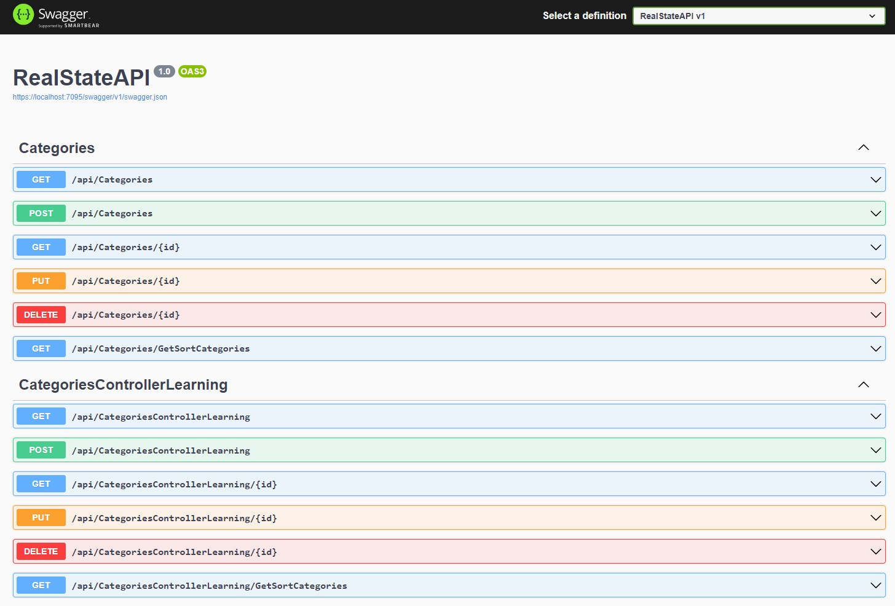
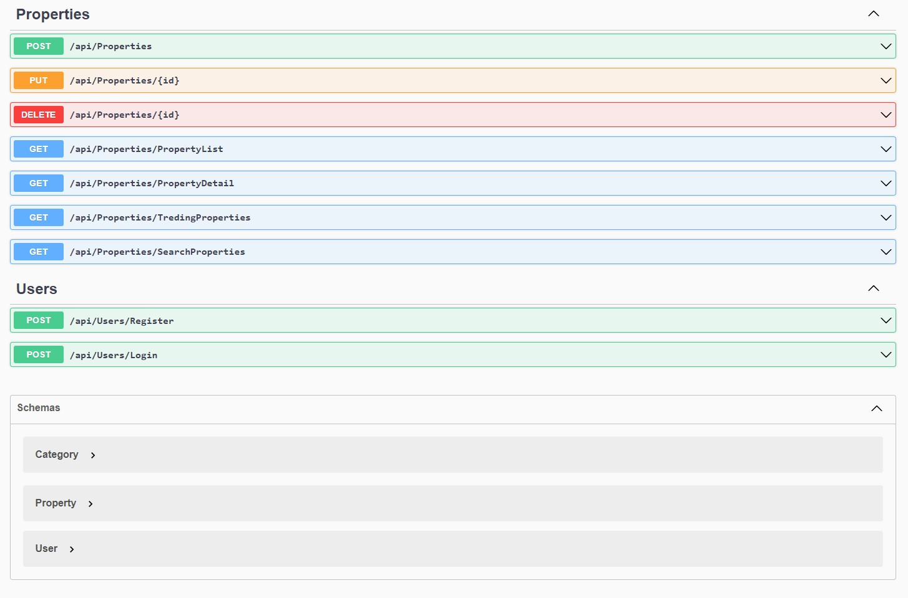

<!-- <p align="center"><a href="https://lukreitor.github.io/linkpe"></a></p>
<p align="center">
	<a href="https://github.com/lukreitor"></a>
	<a href="https://github.com/lukreitor/linkpe/releases"></a>
	<a href="https://github.com/PtPrashantTripathi/linkpe/releases"></a>
	<a href="https://github.com/PtPrashantTripathi/linkpe/LICENSE"></a>
	<a href="https://github.com/PtPrashantTripathi/linkpe/commits"></a>
	<a href="https://ptprashanttripathi.github.io/linkpe"></a>
	<a href="https://github.com/PtPrashantTripathi/linkpe/stargazers"></a>
	<a href="https://github.com/PtPrashantTripathi/linkpe/network/members"></a>
	<a href="https://github.com/PtPrashantTripathi/linkpe/issues"></a>
	<a href="https://github.com/PtPrashantTripathi/linkpe/graphs/contributors"></a>
	<a href="https://github.com/PtPrashantTripathi/linkpe/graphs/traffic"></a>
</p> -->
<p align="center">
	<a href="https://lukreitor.github.io/properties_managment_asp_net_core_7">View Demo</a>·
	<a href="https://github.com/lukreitor/properties_managment_asp_net_core_7/issues/new/choose">Report Bug</a>·
	<a href="https://github.com/lukreitor/properties_managment_asp_net_core_7/issues/new/choose">Request Feature</a>
</p>
<p align="center">
	<i>Loved the tool? Please consider <a href="https://paypal.me/lukreitor/100">donating</a> 💸 to help it improve!</i><br>
	<a href="https://paypal.me/lukreitor"></a>
	<a href='https://ko-fi.com/lukreitor' target='_blank'></a>
	<a href="https://www.buymeacoffee.com/LuKreitor" target="_blank"></a>
	<a href="https://ptprashanttripathi.github.io/linkpe?pa=pt1998@ybl&pn=Pt.+Prashant+Tripati" target="_blank"></a>
</p>

## About

The API is a C# based API to manage properties, just fill your UPI deatils Create properties and add your properties in each profile

## 🚀 Screenshot




> Try the tool: [TRY_API](https://API.nothosted)

## 🧐 Features

- **Use anywhere, browser**
- _100% Free_ 😍
- _100% Secure_ 🔐
- _Give Suport_ 👉
- _No Hidden Secrets_ 🚫
- _Set Your Own Goals_ 💰
- _No Data Storage_ 🎉
- _Simple Interface_ 💥
- _Supports JSON and XML_ ✅
- _Best alternative for JAVA APIS_

## 🛠️ Installation Steps

1. Download directly from github (and unpack) or Clone the repository

```bash
git clone https://github.com/lukreitor/properties_managment_asp_net_core_7
```

2. Open the Project in Visual Studio:

```bash
Launch Visual Studio and go to File > Open > Project/Solution. Navigate to the directory where you cloned the repository and select the solution file with the .sln extension (e.g., properties_managment_asp_net_core_7.sln).
```

3. Restore Dependencies:

```bash
Once the project is opened, right-click on the solution in the Solution Explorer, and choose Restore NuGet Packages. This will download and restore the required NuGet packages for the project.
```

4. Set up the Database:

```bash
The project might be using a database, so you'll need to set it up. Look for a file named appsettings.json in the project (usually under the PropertiesManagement folder) and update the connection string according to your database setup.
```

5. Run the Application:

```bash
Select the appropriate startup project by right-clicking on the project you want to run (usually named PropertiesManagement or similar) and choose Set as StartUp Project. Then, press F5 or click the Start Debugging button to run the application.
```

6. Access the Application:

```bash
Once the application is running, it should open in your web browser. If it doesn't, check the output window in Visual Studio for any error messages.
```

🌟 then wallah! You are all set.

## Usage

change {variable} and use as an js api

```js
the apis are on the image
```

## 🍰 Contributing

Please contribute using [GitHub Flow](https://guides.github.com/introduction/flow). Create a branch, add commits, and [open a pull request]( https://github.com/lukreitor/properties_managment_asp_net_core_7/compare).

Please read [`CONTRIBUTING`](CONTRIBUTING.md) for details on our [`CODE OF CONDUCT`](CODE_OF_CONDUCT.md), and the process for submitting pull requests to us.

## 💻 Built with

- [.NET](https://dotnet.microsoft.com/pt-br/)
- [Visual Studio](https://visualstudio.microsoft.com)

## 🙏 Support

<p align="left">
<a href="https://www.paypal.me/lukreitor">
</a>

<a href="link to website">

</a>
</p>
<p align="left">
  <a href='https://ko-fi.com/lukreitor' target='_blank'>
  </a>
  <a href="https://www.buymeacoffee.com/LuKreitor" target="_blank">
</p>

## Contributors ✨

<table>
	<tr>
		<th align="center">
				<a href="https://github.com/lukreitor">
					<sub><b>Lucas Martins da Silva Sena</b></sub>
				</a>
		</th>
  	</tr>
 	<tr>
		<td align="center">
			<a href="https://github.com/lukreitor">
				
			</a>
		</td>
	</tr>
</table>

## Questions and Feedback

**Please contact me using one of the following:**

[](https://twitter.com/lukreitor) 
[](https://www.linkedin.com/in/lucasmartins-2001-2018/) 
[](https://www.instagram.com/lucas15_m.s/) 
[](https://t.me/lukreitor/) 
[](https://www.facebook.com/profile.php?id=100008448453915) 
[](https://dev.to/username)  

<p align="center">  
<hr>Developed with ❤️ in Brazil 🇮🇳 
</p>
